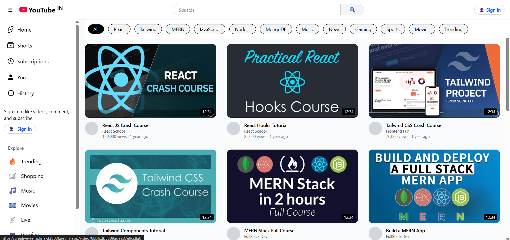
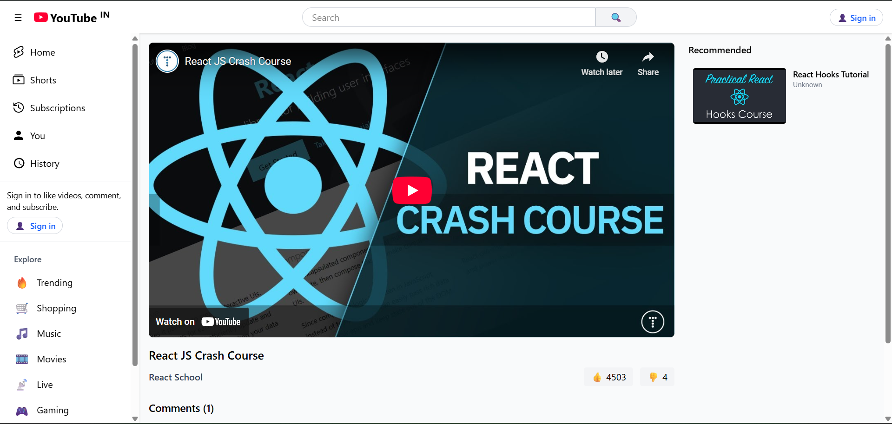
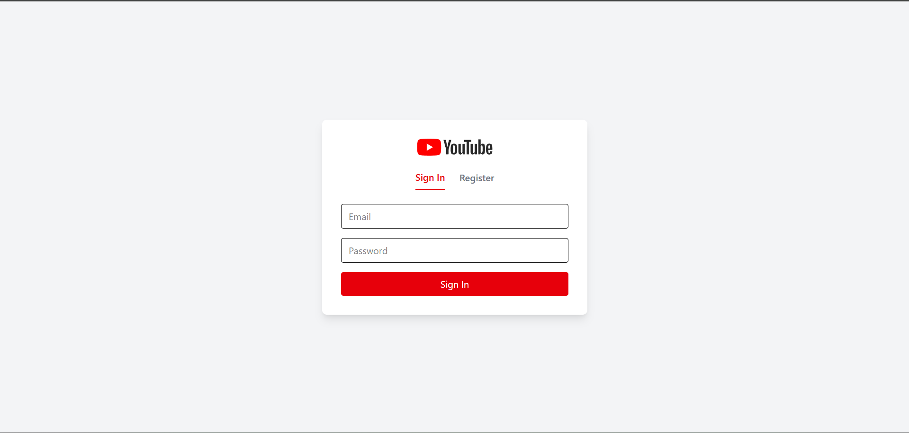

# 🎬 YouTube Clone (Frontend)

A fully functional **YouTube Clone** built with **React.js** on the frontend and powered by a custom backend server (deployed on Render).  
This project mimics YouTube’s core features like browsing videos, playing videos, liking/disliking, commenting, and exploring channels.

🔗 **Frontend Repository:** [Youtube-clone-FE-final](https://github.com/vjbravo123/Youtube-clone-FE-final.git)

🌍 **Live Project:** [YouTube Clone Live](https://creative-semolina-33808f.netlify.app/)

---

## 🚀 Features
- 📺 Watch videos with a custom video player  
- 👍 Like / 👎 Dislike system  
- 💬 Commenting functionality  
- 📂 Explore channels and their uploaded videos  
- 🔍 Search and filter videos  
- 📱 Fully responsive design  

---

## 🛠️ Tech Stack
- **Frontend:** React.js, React Router DOM, Axios, CSS  
- **Backend:** Node.js, Express.js, MongoDB (deployed on **Render**)  
- **Deployment:** Render (backend) + [Your frontend hosting platform, e.g. Vercel/Netlify]  

---

## ⚠️ Important Note
Since the backend is deployed on **Render’s free tier**, the server **goes to sleep after 50 seconds of inactivity**.  
👉 Please wait **30–60 seconds** on the first request for the server to **wake up**.  

---

## 🔑 Sample Credentials
To explore the app quickly, you can log in using the following test account:

- **Email:** `josh@gmail.com`  
- **Password:** `123`  

---

## 📂 Installation & Setup

### 1️⃣ Clone the repository
```bash
git clone https://github.com/vjbravo123/Youtube-clone-FE-final.git
cd Youtube-clone-FE-final

```

### 2️⃣ Install dependencies
```bash
npm install
```

### 3️⃣ Start the development server
```bash
npm run dev
```

The app will run locally at:  
👉 `http://localhost:5173/`

---

## 📸 Screenshots




---


## 🤝 Contributing
Contributions are welcome! Feel free to fork the repo and submit a pull request.

---

## 📜 License
This project is licensed under the **MIT License**.
